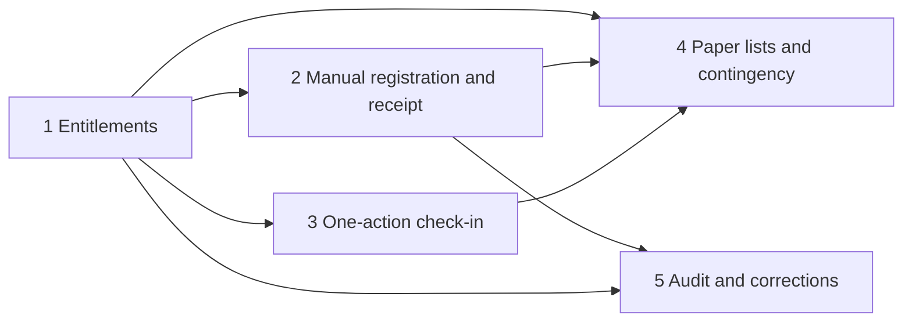

# November 2026 MVP delivery slices

> **Status:** Proposed planning document; not a contract. Exception: Slice 1 is delivered (#124, see its delivery status).\
> **Date:** 2026-10-06\
> **Sources:** [November 2026 MVP proposal](november-2026-mvp-proposal.md) (organizer-facing, Spanish) and the [contracts](../contracts/) it depends on.

This document turns the organizer-approved MVP scope into five delivery slices. Each slice states what the organizer already decided, what the repository delivers today, the proposed design, and the gap between them. The design is a **recommendation**: nothing in the "Proposed" rows exists in the code yet.

## How to read this document

| Label         | Meaning                                                                                   |
| ------------- | ----------------------------------------------------------------------------------------- |
| **Confirmed** | Organizer decision recorded in the proposal or the operational questionnaire.             |
| **Proposed**  | Design recommendation from this document. Not implemented, not a contract.                |
| **Pending**   | Open decision. Needs an owner before the affected work ships.                             |
| **Delivered** | Existing behavior in the repository, with path evidence. Describes `dev` as of this date. |

Source shorthand:

- **P §x** — section of `docs/product/november-2026-mvp-proposal.md` (working-tree version, including the uncommitted organizer-alignment edits).
- **Q n** — answer `n` of the organizer operational questionnaire (temporary working file, not versioned). Each Q citation is also reflected in the proposal; the proposal is the durable source.
- Issue numbers (#58, #64, …) are the ones referenced in local docs. Their remote state is **not verified** here.

## Summary

| #   | Slice                                          | Main gap today                                                                           | Suggested order                      |
| --- | ---------------------------------------------- | ---------------------------------------------------------------------------------------- | ------------------------------------ |
| 1   | Pass entitlements and optional activities      | Delivered via #124; see the [event catalog contract](../contracts/event-catalog.md).     | 1st                                  |
| 2   | Manual registration, duplicates, cash receipt  | Duplicates are hard-blocked; receipt is optional; fields differ from #58.                | 2nd (parallel with 1 where possible) |
| 3   | One-action check-in with on-arrival enrollment | Two visible actions; activity check-in needs prior event fact and prior enrollment.      | 3rd                                  |
| 4   | Paper lists and paper contingency              | No list or print view exists; contingency is a runbook only.                             | 4th (can start after 1)              |
| 5   | Audit, identity warnings, cash corrections     | Audit facts exist for manual/cash writes only; no correction commands or history reader. | 5th                                  |

---

## Slice 1 — Entitlements for multiple full passes and optional activities

**Goal:** model what a person bought (passes) separately from what they chose to take part in (competitions, workshops), so access checks and lists can be derived from entitlements.

> **Delivery status:** delivered through #124 "Model event catalog: admin-managed activities and pass entitlements", PRs #128–#133 plus the documentation PR for its contract. The delivered behavior is the [event catalog contract](../contracts/event-catalog.md). Discipline eligibility is data, not code: a pass type grants its discipline's workshops through `included` access and its competitions through `selectable` access. The "Delivered", "Proposed design" and "Gap" sections below are the pre-#124 planning record. UI hardening (T8) and check-in use of entitlements (#126) remain open.

### Confirmed decisions

| Decision                                                                                                       | Source            |
| -------------------------------------------------------------------------------------------------------------- | ----------------- |
| The sale unit is the pass, not the activity.                                                                   | P §1, Q 1         |
| Full pass for Breaking, Popping, Locking or Dancehall: $2000 each. A person may buy several full passes.       | P §1, Q 1         |
| General entry: $1000. Includes no competitions and no workshops.                                               | P §1, Q 1         |
| Open Styles: $800 add-on, 1vs1 competition, no workshops, requires at least one full pass.                     | P §1, Q 1         |
| Competitions per discipline are fixed (e.g. Locking: 1v1 and 3v3).                                             | P §1              |
| Competition and workshop participation is optional. Competitions are selected at purchase.                     | P §1, Q 1         |
| An administrator may change a competition selection after purchase, even past the selection deadline.          | P §1, Q 1         |
| Workshops are announced later; eligible holders choose among workshops of any discipline they hold a pass for. | P §1              |
| No workshop capacity or prerequisites are managed by the system.                                               | P §1, Q 1         |
| General entry alone grants no activity access.                                                                 | P "Check-in", Q 5 |
| Schedule overlap notice shown before payment; Open Styles never overlaps a full-pass competition.              | P §2, Q 1         |

### Delivered (current behavior)

- Activities are neutral rows with a free-text `kind`; there is no price, pass, or capacity field. Evidence: `apps/backend/src/database/schema/activities.ts`, `docs/contracts/event-activity-foundation.md` (deferred decisions table).
- An event registration links to activities through activity registrations; no concept of "pass" or "entitlement" exists. Evidence: `apps/backend/src/database/schema/registrations.ts`.
- Recognized check-in activity kinds are `workshop`, `battle`, `competition`. Evidence: `apps/backend/src/events/check-in/check-in.service.ts:52`.

### Proposed design

- Add a pass/entitlement concept per event registration: zero or more full passes (one per discipline), at most one general entry, and an Open Styles add-on valid only with at least one full pass.
- Link each competition activity to its discipline so eligibility is derivable: "holds a full pass for discipline D" → may enroll in D's competitions and workshops.
- Keep enrollment (activity registration) separate from entitlement. Entitlement answers "may attend"; enrollment answers "chose to attend".
- Prices are display/sale data per pass type, not per activity.

### Gap vs current

New persistence and validation for passes, discipline-to-activity mapping, and the Open Styles dependency rule. Public sale and payment are outside this slice.

### Pending decisions

- Selection deadline date and owner (P §1; Q 1 open).
- Workshop list, dates, times and venues (P §1; Q 1 open).
- How the equal-price discipline swap works for a holder of several full passes (P "Correcciones acotadas").
- ~~Whether general entry is an activity-like row or a separate concept.~~ Resolved by #124: a `general` pass type with no activity access.

### Dependencies

None upstream. Slices 2, 3 and 4 consume entitlements.

### Acceptance criteria

- [ ] A registration can hold two or more full passes of different disciplines.
- [ ] Open Styles cannot be added to a registration without a full pass; the attempt is rejected without a write.
- [ ] A general-entry-only registration is not eligible for any competition or workshop.
- [ ] Eligibility for a workshop is true only when the registration holds a full pass for that workshop's discipline.
- [ ] Removing or changing a competition selection does not change the purchased passes.

### Related issues (local references)

#57 (MVP proposal alignment), #60 (event/activity foundation), #62 (participant/registration model).

---

## Slice 2 — In-person registration, duplicate confirmation, mandatory cash receipt

**Goal:** an administrator registers a walk-in with the #58 data, confirms possible duplicates by human judgment, and records cash only with a physical receipt number.

### Confirmed decisions

| Decision                                                                                                                                     | Source                                              |
| -------------------------------------------------------------------------------------------------------------------------------------------- | --------------------------------------------------- |
| A private admin module collects the same data as online registration (#58 fields).                                                           | P "Registro y pago en efectivo", Q 3                |
| #58 inputs: required first name, first last name, email, phone; optional second last name, AKA, country, city, Instagram, level, birth date. | `docs/contracts/admin-registration-operations.md:8` |
| An email or phone match requires human confirmation by an administrator; no automatic block.                                                 | P "Registro y pago en efectivo", Q 3                |
| Staff physically verify the cash amount before recording it.                                                                                 | P "Registro y pago en efectivo", Q 4                |
| Every cash payment uses a numbered duplicate (carbon) paper receipt: copy to participant, original kept by organizers.                       | P "Registro y pago en efectivo", Q 4                |
| The receipt number is mandatory in the digital cash record.                                                                                  | P "Registro y pago en efectivo", Q 4                |
| Only administrators, never judges, may record cash.                                                                                          | P "Registro y pago en efectivo", Q 2                |

### Delivered (current behavior)

- `POST /admin/events/:eventId/registrations/manual` requires `fullName` and `phone`; `email` is optional. Evidence: `apps/backend/src/events/manual-registration/manual-registration.controller.ts:47-50`.
- Participants store `full_name`, `email`, `phone`, `stage_name` only; the split #58 fields do not exist. Evidence: `apps/backend/src/database/schema/participants.ts:8-11`.
- A same-event match on phone or email **blocks** creation with `Duplicate registration`. Evidence: `apps/backend/src/events/manual-registration/manual-registration.service.ts:30-41`.
- Cash confirmation requires a positive amount in cents; `reference`, `note` and `receipt` are **optional**. Evidence: `manual-registration.controller.ts:71-96`; `apps/backend/src/database/schema/registration-operation-audit.ts:35-38` (nullable `receipt`).
- Creation and cash confirmation each append an operation audit fact in the same transaction; judges are rejected. Evidence: `odd/tasks/admin-manual-registration-cash.md` (Constraints, Evidence).
- No admin UI for manual registration or cash exists (#105 is not delivered). Evidence: no manual/cash screen under `apps/frontend/src`.

### Proposed design

- Extend participant/registration inputs to the #58 field set for **new** manual registrations.
- Replace the hard block with a two-step flow: the server returns possible matches (same event, email or phone); the administrator either links to the existing participant or explicitly confirms a new one. The server revalidates matches inside the write transaction and records the confirmation in the audit fact.
- Make the receipt number required and non-blank for **new** cash confirmations; keep it in the audit fact.
- Keep earlier rows with an empty receipt as legacy; do not invent receipt numbers for them.
- Pass and selection data from slice 1 is captured at registration time.

### Gap vs current

Schema and validation change for #58 fields; a duplicate-confirmation contract change (block → confirm); receipt becomes required; admin UI (#105) for registration and cash.

### Pending decisions

- Receipt number format and uniqueness scope (per event, per receipt book, global).
- How possible matches are presented without leaking data the operator should not see.
- Whether matching should also consider other events through the shared participant identity.

### Dependencies

Slice 1 for pass selection at registration. Slice 5 audit shape for the duplicate-confirmation fact.

### Acceptance criteria

- [ ] A manual registration without first name, first last name, email or phone is rejected without a write.
- [ ] A same-event email or phone match returns the candidate match instead of a hard error, and no registration is created until the administrator confirms.
- [ ] A confirmed "new person despite match" write records the confirmation in the operation audit fact.
- [ ] A match that appears between preview and confirmation is detected inside the write transaction.
- [ ] A cash confirmation with a missing or blank receipt number is rejected without a write.
- [ ] A judge session cannot create a registration or record cash.

### Related issues (local references)

#58, #103, #105, #101.

---

## Slice 3 — One visible check-in action with on-arrival workshop enrollment

**Goal:** at each activity entrance, staff perform one action. The system records the event attendance fact internally and, for an eligible full-pass holder not yet enrolled in a workshop, enrolls and checks in within the same interaction.

### Confirmed decisions

| Decision                                                                                                                        | Source                  |
| ------------------------------------------------------------------------------------------------------------------------------- | ----------------------- |
| An administrator checks people in at each activity entrance, searching by name, folio or email.                                 | P "Check-in", Q 5       |
| The system shows whether the person is entitled to that activity.                                                               | P "Check-in", Q 5       |
| No separate visible event check-in; event attendance is derived from activity attendance.                                       | P "Check-in", Q 5       |
| An eligible full-pass holder not enrolled in a workshop can be enrolled and checked in in the same interaction.                 | P §1, P "Check-in", Q 5 |
| The internal event fact may remain, as long as staff see one action.                                                            | P "Check-in"            |
| Late arrivals are resolved in person; a lost folio is resolved by name/email search.                                            | P "Check-in", Q 6       |
| Missing/pending payments and unresolved access are escalated to principal coordination (same admin role, no extra permissions). | P "Check-in", Q 2, Q 6  |

### Delivered (current behavior)

- Event check-in: `POST /admin/events/:eventId/registrations/:registrationId/check-in`, once per confirmed registration. Evidence: `docs/contracts/operational-check-in.md:3`; `apps/backend/src/events/check-in/check-in.service.ts:100-111`.
- Activity check-in requires a **prior event check-in** fact. Evidence: `check-in.service.ts:64` (`Event check-in required before activity check-in`).
- Activity check-in requires a **prior enrollment** in that activity. Evidence: `check-in.service.ts:50-51` (`Registration is not enrolled in this activity`).
- The operator screen shows two visible actions: event check-in first, then per-activity check-in offered only after the event fact. Evidence: `apps/frontend/src/pages/admin/ui/admin-check-in-page.tsx:142-145, 342-350`; `odd/tasks/event-day-check-in.md` (Acceptance).
- No command exists to add a workshop enrollment to an existing registration.
- Live browser-to-PostgreSQL evidence exists for the current two-step flow (#112). Evidence: `odd/tasks/event-day-check-in.md` (T7, D8).

### Proposed design

- One command, "admit to activity", executed in one database transaction:
  1. Verify the registration is confirmed and entitled to the activity (slice 1).
  2. If the activity is a workshop and the registration is not enrolled, create the enrollment.
  3. Create the event attendance fact if absent (idempotent, internal).
  4. Create the activity attendance fact.
- Each write keeps actor, session reference and server time; enrollment-on-arrival appends an audit fact.
- Competition admission still requires a selected competition; on-arrival enrollment applies to workshops only.
- Repeats return a conflict, never a second fact. Partial failure rolls back all steps.
- The screen replaces the two buttons with one action per activity and shows entitlement, enrollment and attendance state.
- Existing event-only facts from the current flow remain valid history.

### Gap vs current

New combined command and contract revision of `docs/contracts/operational-check-in.md`; entitlement checks (slice 1); enrollment-on-arrival write; UI change. The current endpoints may remain for compatibility, decision pending.

### Pending decisions

- Whether the standalone event check-in endpoint stays, is hidden from the UI, or is retired.
- Whether competition selection changes at the entrance are allowed in the same action or only through slice 5 corrections.
- Who coordinates on-arrival workshop enrollment staff (Q 1 open).

### Dependencies

Slice 1 (entitlements). Slice 5 audit fact shape for enrollment-on-arrival.

### Acceptance criteria

- [ ] For an enrolled, entitled, confirmed registration with no event fact, one request creates both the event fact and the activity fact.
- [ ] For an eligible full-pass holder not enrolled in a workshop, one request creates enrollment, event fact and activity fact atomically.
- [ ] A general-entry-only registration is denied activity admission with no write.
- [ ] A full-pass holder of discipline A is denied a workshop of discipline B unless also holding B.
- [ ] A forced failure in any step leaves no enrollment or attendance fact.
- [ ] The operator screen offers exactly one admit action per eligible activity.
- [ ] A repeated admit returns a conflict and creates no second fact.

### Related issues (local references)

#64, #112.

---

## Slice 4 — Paper lists and paper contingency with provisional cash and access

**Goal:** administrators prepare contact-free lists per pass and activity in advance, and can keep the event moving on paper during an outage, including provisional cash collection and access, reconciled manually afterwards.

### Confirmed decisions

| Decision                                                                                                                                                            | Source               |
| ------------------------------------------------------------------------------------------------------------------------------------------------------------------- | -------------------- |
| Any administrator can prepare lists in advance (even the day before), via browser print or save as PDF.                                                             | P "Continuidad", Q 7 |
| Lists: full event, general entry, each full pass (Breaking, Popping, Locking, Dancehall), Open Styles, workshops/other activities.                                  | P "Continuidad"      |
| Columns: name, AKA, pass, activity, registration status, recorded attendance. No contact data.                                                                      | P "Continuidad", Q 7 |
| Lists are point-in-time snapshots and may be outdated.                                                                                                              | P "Continuidad", Q 7 |
| No CSV/Excel in the MVP.                                                                                                                                            | P "No incluido"      |
| Only the main studio has a guaranteed printer.                                                                                                                      | P "Continuidad", Q 7 |
| During an outage any administrator may collect cash from a new person, hand over the numbered receipt, record a temporary paper entry and grant provisional access. | P "Continuidad", Q 7 |
| After recovery, each case is verified manually against current state, checked for duplicates, and the receipt number is linked to the digital cash record.          | P "Continuidad", Q 7 |
| No automatic sync, blind replay, or digital confirmation during the outage; ambiguous cases stop the affected write and escalate.                                   | P "Continuidad", Q 7 |

### Delivered (current behavior)

- No list, print or PDF view exists. Evidence: no print/list screen under `apps/frontend/src`; `odd/tasks/november-mvp-organizer-alignment.md` ("does not deliver printable lists").
- The paper contingency exists only as procedure. Evidence: `docs/runbooks/event-day.md:29-38, 62`.
- Protected, paginated, event-scoped registration search with attendance projection exists and can be a data source. Evidence: `apps/backend/src/events/registration-search/`; `odd/tasks/event-day-check-in.md` (T1).

### Proposed design

- A protected, read-only list view per event with filters by pass and by activity, rendered for browser print/PDF. No contact fields in the response, not only hidden in the UI.
- A visible generation timestamp on every page so staff know the snapshot age.
- Recovery uses the normal connected commands (slices 2 and 3): register, confirm human duplicates, record cash with the receipt number, admit. No bulk import and no offline queue.
- Update the event-day runbook to describe provisional cash and access and the post-recovery checklist.

### Gap vs current

New read endpoint or projection grouped by pass/activity; print-oriented page; runbook update. Recovery writes reuse slices 2 and 3 rather than adding new commands.

### Pending decisions

- Distribution of printed copies across venues and who owns paper per shift (Q 7 open).
- Printer availability outside the main studio (P "Validación").
- Whether a recovered write should carry an explicit "recorded after outage" marker in the audit fact.

### Dependencies

Slice 1 for pass grouping. Slices 2 and 3 for recovery writes. Slice 5 for the optional recovery marker.

### Acceptance criteria

- [ ] An authorized administrator can produce each list type listed above for one event.
- [ ] The list response contains no email, phone or other contact field.
- [ ] A judge or wrong-event session receives a safe denial and no data.
- [ ] Each printed page shows the event and the generation time.
- [ ] The runbook describes provisional cash/access and the manual post-recovery verification, with no automatic sync.

### Related issues (local references)

#65.

---

## Slice 5 — Audit, identity warnings, cash corrections and history

**Goal:** administrators make bounded, reasoned corrections with an append-only history that any event administrator can read.

### Confirmed decisions

| Decision                                                                                                             | Source                               |
| -------------------------------------------------------------------------------------------------------------------- | ------------------------------------ |
| Only administrators, never judges, may correct records. All event administrators may read the event history.         | P "Correcciones", Q 2, Q 8           |
| Name/AKA corrections show a visible warning about the shared cross-event identity and require explicit confirmation. | P "Correcciones", Q 4                |
| No automatic propagation of changes across events is assumed.                                                        | P "Correcciones"                     |
| Equal-price discipline swap among Breaking, Popping, Locking, Dancehall.                                             | P "Correcciones"                     |
| Justified void of a pending registration only.                                                                       | P "Correcciones"                     |
| Cash correction requires checking the original receipt and recording a reason.                                       | P "Registro y pago en efectivo", Q 4 |
| Paid cases needing reversal escalate to principal organizers or coordination outside automated MVP corrections.      | P "Correcciones"                     |
| No Mercado Pago edits, refunds, transfers, general-to-participant upgrade, or folio edits.                           | P "No incluido", P "Correcciones"    |
| Two years of history is desired for event analysis only, subject to technical and legal review.                      | P "Correcciones", Q 8                |

### Delivered (current behavior)

- An append-only operation audit table exists for `manual_registration` and `cash_confirmation`, written in the same transaction as the mutation. Evidence: `apps/backend/src/database/schema/registration-operation-audit.ts`; `odd/tasks/admin-manual-registration-cash.md`.
- The audit and correction policy is a design contract; correction and void commands do not exist. Evidence: `docs/contracts/admin-registration-audit-policy.md:3, 10`.
- No history reader API or UI exists. Evidence: `odd/tasks/admin-manual-registration-cash.md` (Constraints: no audit-reader UI/API).

### Proposed design

- Implement the `registration_correction`, `registration_void` (pending only) and `cash_correction` operation facts as specified in `docs/contracts/admin-registration-audit-policy.md`, with mandatory reason and redacted before/after values.
- Name/AKA correction: the server returns the cross-event impact (count of other events, no foreign data); the write requires an explicit confirmation flag and records it.
- Cash correction: requires the original receipt number to match the recorded one and a reason; the original amount, actor and time remain in history.
- Event-scoped history reader for administrators, read-only, redacted.

### Gap vs current

New correction/void commands, cash correction transitions, history read endpoint, UI (#105). Contract text that still names "coordination staff verification and minimum evidence" for cash corrections needs to be aligned with the confirmed "original receipt check and reason" rule.

### Pending decisions

- Safeguards and transitions when the original receipt is unavailable or the correction is disputed (P "Correcciones", Q 4 open).
- Discipline-swap mechanics for holders of several full passes (P "Correcciones").
- Retention mechanism and legal feasibility of two years of history (Q 8 open).
- Reason shape and redaction rules (`docs/contracts/admin-registration-audit-policy.md`, blocker 4).

### Dependencies

Slice 2 (receipt number required, so cash corrections have a receipt to check). Slice 1 for discipline swap semantics.

### Acceptance criteria

- [ ] A name/AKA correction without explicit cross-event confirmation is rejected without a write.
- [ ] Every accepted correction or void appends one immutable audit fact in the same transaction; a forced audit failure rolls back the change.
- [ ] A void of a confirmed registration is rejected.
- [ ] A cash correction whose receipt number does not match the recorded original is rejected.
- [ ] The original cash amount, actor and timestamp remain readable in history after a correction.
- [ ] A judge cannot correct or read history; a wrong-event administrator receives a safe denial.
- [ ] History responses contain no contact data, raw session identifiers or full request bodies.

### Related issues (local references)

#101, #104, #105.

---

## Dependencies and suggested order

1. **Slice 1** first: every other slice reads entitlements.
2. **Slice 2** next: it fixes behavior that contradicts confirmed policy (hard duplicate block, optional receipt). The receipt and duplicate-confirmation parts do not need slice 1 and can start in parallel.
3. **Slice 3**: changes a delivered contract; plan it as a revision of `docs/contracts/operational-check-in.md` before code.
4. **Slice 4**: the read-only lists can ship right after slice 1; the recovery checklist depends on slices 2 and 3.
5. **Slice 5**: gated on pending cash-correction safeguards and retention decisions.

## Known contract and document mismatches

These are documentation follow-ups, not code claims:

- `docs/contracts/admin-registration-audit-policy.md:3` and `docs/contracts/admin-registration-operations.md:3` still describe the proposal as "DRAFT pending organizer validation"; the working-tree proposal now states the general MVP scope is approved.
- `docs/contracts/operational-check-in.md:5` says a general-pass-only registration "only receives event check-in"; the confirmed design has no visible event check-in.
- Cash-correction wording in the audit contract (coordination verification, minimum evidence) predates the confirmed "original receipt check and reason" rule.
- `docs/product/november-2026-mvp-proposal.html` may not match the updated Markdown proposal.

## Issue matrix

Read-only GitHub review of `KevinBarrera/nuestro-breaking` on 2026-10-06. No issue was modified. Closed issues keep their delivered history; changes to delivered behavior become new follow-ups. The proposed follow-ups were later created as #124–#127; references below use those numbers.

### Existing issues

| Issue                                                              | Remote state (2026-10-06) | Slice | Proposed action                                                                                                                                                                                                                                                                        |
| ------------------------------------------------------------------ | ------------------------- | ----- | -------------------------------------------------------------------------------------------------------------------------------------------------------------------------------------------------------------------------------------------------------------------------------------- |
| #57 Track November 2026 MVP delivery plan                          | Open epic                 | All   | Update: link this document and the follow-ups #124–#127 as tracks.                                                                                                                                                                                                                     |
| #58 Validate organizer-facing MVP assumptions                      | Closed (completed)        | 2     | None. Decisions are recorded; field alignment goes to #125.                                                                                                                                                                                                                            |
| #60 Define event and activity foundation                           | Closed (completed)        | 1     | None. Pass entitlements go to #124.                                                                                                                                                                                                                                                    |
| #62 Model participant identity and event activity registration     | Closed (completed)        | 1     | None. Pass entitlements go to #124.                                                                                                                                                                                                                                                    |
| #64 Prepare check-in operational model                             | Closed (completed)        | 3     | None. Single-action admission goes to #126.                                                                                                                                                                                                                                            |
| #101 Define audit facts and correction policy                      | Closed (completed)        | 5     | None. Receipt-based cash correction is carried by #104 and the contract update in #127.                                                                                                                                                                                                |
| #103 Add authorized manual registration and cash-payment recording | Closed (completed)        | 2     | None. Duplicate confirmation and mandatory receipt folio go to #125.                                                                                                                                                                                                                   |
| #112 Add MVP event-day admin check-in screen                       | Closed (completed)        | 3     | None. One visible action and on-arrival workshop enrollment go to #126.                                                                                                                                                                                                                |
| #65 Deliver printable attendee lists and paper fallback            | Open, `status:ready`      | 4     | Update: add lists per pass (Breaking/Popping/Locking/Dancehall, Open Styles, general), provisional cash collection with numbered receipt, provisional paper access, and post-recovery manual verification. Add dependency on #124 for pass grouping.                                   |
| #104 Add audited, authorized correction of registration errors     | Open, `status:blocked`    | 5     | Update: replace "minimum supporting evidence" with verification against the original numbered receipt plus reason; add name/AKA identity warning with explicit confirmation; keep pending decisions (missing or disputed receipt, multi-pass swap, retention). Add dependency on #125. |
| #105 Add admin registration operations UI                          | Open, `status:blocked`    | 2, 5  | Update: depend on #125 (backend duplicate confirmation and mandatory receipt folio) in addition to #102/#103/#104; require the receipt folio field in the cash flow. Its possible-duplicate confirmation scope already matches the design.                                             |
| #59 Validate Mercado Pago production constraints                   | Open                      | —     | Out of scope for these slices.                                                                                                                                                                                                                                                         |

### Follow-up issues

The proposed follow-ups F1–F4 were created on GitHub as #124–#127.

| Issue | Slice | Title                                                                              | Depends on                  | Delivery status                              |
| ----- | ----- | ---------------------------------------------------------------------------------- | --------------------------- | -------------------------------------------- |
| #124  | 1     | Model event catalog: admin-managed activities and pass entitlements                | #60, #62 (delivered)        | Delivered via PRs #128–#133 plus its docs PR |
| #125  | 2     | Confirm possible duplicates and require cash receipt number in manual registration | #103 (delivered)            | Open                                         |
| #126  | 3     | Single-action activity check-in with on-arrival workshop enrollment                | #64, #112 (delivered), #124 | Open                                         |
| #127  | 2–5   | Align MVP contracts and docs with confirmed organizer decisions                    | This document               | Open                                         |

## Next step

Decide whether to apply the updates to #57, #65, #104 and #105 on GitHub. That requires a separate explicit authorization for remote writes. Delivered work (#58, #60, #62, #64, #101, #103, #112) stays as recorded.
