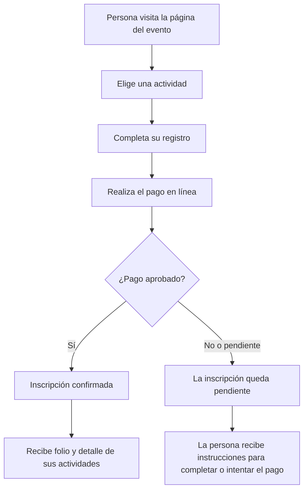
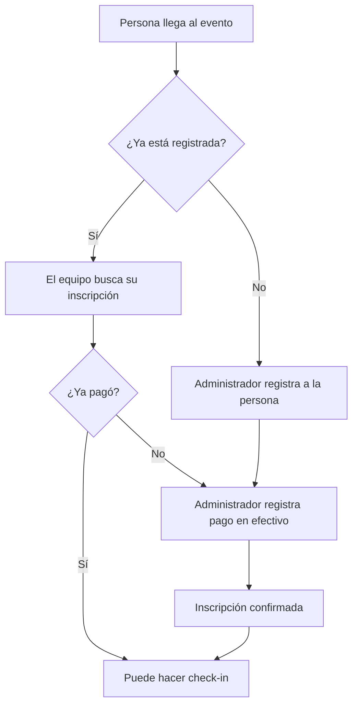
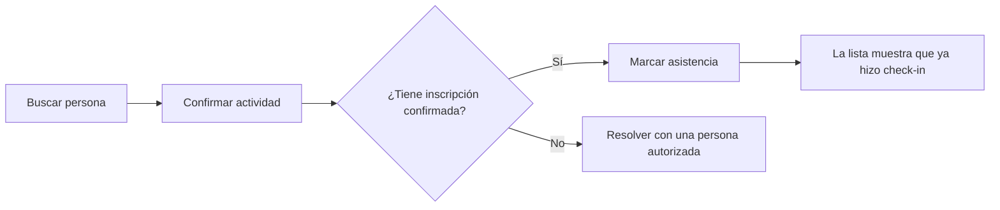
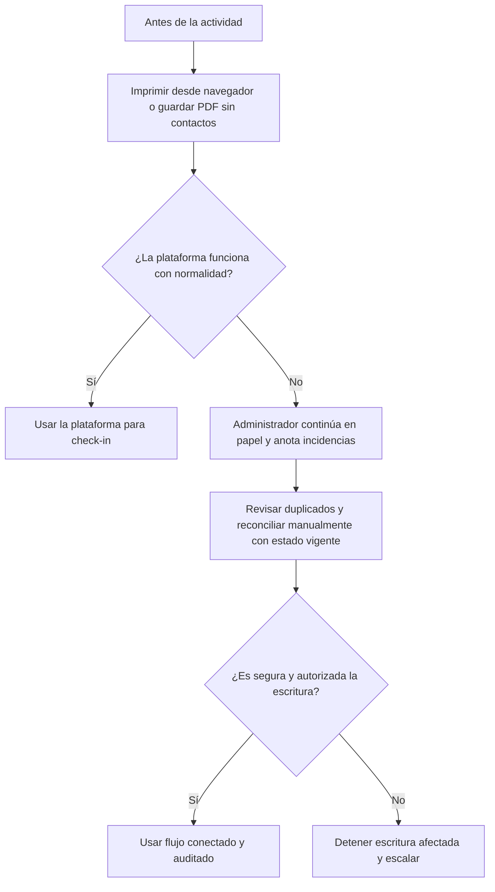

# Propuesta de MVP para noviembre de 2026

> **Estado:** DRAFT — propuesta para validar con el equipo organizador.\
> **Objetivo:** que una persona pueda comprar su acceso, quedar registrada y hacer check-in el día del evento. El equipo organizador podrá registrar pagos en efectivo y consultar listas de asistentes.

## Resumen

La propuesta busca reemplazar una parte del trabajo manual con una experiencia sencilla, similar a comprar y validar una entrada en una plataforma de eventos:

1. Una persona elige una actividad.
2. Completa sus datos y paga en línea.
3. Su inscripción queda confirmada cuando el pago se aprueba.
4. Al llegar, el equipo realiza el check-in.

La plataforma debe ayudar al evento, nunca detenerlo. Antes de cada actividad, una persona administradora podrá imprimir desde el navegador o guardar como PDF una lista para continuar en papel si fuera necesario.

## Experiencia de compra en línea

### 1. Elegir actividad

La página mostrará las actividades disponibles, por ejemplo:

- Competencia de breaking.
- Workshop.
- Entrada general.

Los accesos se agrupan por evento: entrada general y pase completo; para competir, por disciplina (Breaking, Popping, Locking o Dancehall) u Open Styles; y para talleres, por workshop. Cada opción podrá mostrar precio, fecha, lugar y disponibilidad. Se registra asistencia al evento y, cuando corresponda, a cada actividad.

### 2. Registrarse y pagar

La persona completa un registro sencillo con los datos necesarios para asistir o competir. Después pasa a una pantalla de pago segura.

Cuando el pago está aprobado, recibe:

- Confirmación de su inscripción.
- Un folio para identificarse.
- El detalle de las actividades que compró.

> La plataforma no confirma una inscripción solo porque la persona regresó de la pantalla de pago. La confirma cuando el pago está realmente aprobado.

## Registro y pago en efectivo

Si una persona llega sin haber pagado en línea, una persona autorizada del equipo puede registrarla y marcar el pago en efectivo.

El comprobante puede entregarse, pero no es requisito para confirmar el efectivo. Solo personas administradoras autorizadas, nunca jueces, podrán registrar efectivo o corregir un registro. Para corregir efectivo, coordinación deberá verificar la operación, registrar el motivo y conservar evidencia mínima. El sistema conservará quién realizó cada operación para que el equipo pueda revisarla después.

## Check-in de competencias y workshops

Al llegar a una actividad, el personal busca a la persona por nombre, correo, nombre artístico o folio.

El equipo podrá ver de inmediato si la persona:

- Está registrada.
- Tiene una inscripción confirmada.
- Ya hizo check-in.
- Tiene acceso a la competencia o workshop correspondiente.

## Panel para el equipo organizador

| Necesidad          | Qué podrá hacer el equipo                                   |
| ------------------ | ----------------------------------------------------------- |
| Ver inscritos      | Consultar las personas registradas por actividad.           |
| Buscar personas    | Encontrar por nombre, correo, nombre artístico o folio.     |
| Registrar efectivo | Agregar una inscripción presencial y marcar su pago.        |
| Hacer check-in     | Marcar asistencia para una competencia o workshop.          |
| Resolver errores   | Administradores: correcciones acotadas y auditadas.         |
| Tener respaldo     | Imprimir desde el navegador o guardar PDF antes del evento. |

## Continuidad durante el evento

Antes de cada actividad, una persona administradora imprime desde el navegador o guarda como PDF listas actualizadas: una del evento completo, una de entrada general, las de pase completo separadas por Breaking, Popping, Locking y Dancehall, una de Open Styles y las de asistencia a workshops u otras actividades cuando correspondan. Incluyen nombre, AKA, pase, actividad, estado de inscripción y asistencia registrada al evento y, cuando corresponda, a la actividad; no incluyen datos de contacto. Si falla la conexión, el administrador responsable continúa en papel y anota incidencias. Al restablecerse el servicio, revisa manualmente duplicados y reconcilia cada caso contra el estado vigente antes de cualquier escritura autorizada. El papel no es una aplicación sin conexión: no se sincroniza automáticamente ni se reproducen a ciegas registros, pagos o check-ins. Si el estado o la autorización son ambiguos, se detiene la escritura afectada y se escala.

## Incluido en el MVP

- Venta de boletos en línea.
- Registro de asistentes y competidores.
- Confirmación de inscripción después del pago aprobado.
- Registro presencial con pago en efectivo por una persona autorizada.
- Check-in para competencias y workshops.
- Listas para imprimir desde el navegador o guardar como PDF, sin datos de contacto, como respaldo en papel.

## No incluido por ahora

- Brackets, puntuaciones, jueces o selección de ganadores.
- Reembolsos o edición de pagos en Mercado Pago.
- Transferencias, cambio de entrada general a participante y edición de folio.
- CSV/Excel, escrituras sin conexión, sincronización automática o reproducción ciega de anotaciones en papel.
- Administración de hoteles, viajes, mercancía o patrocinadores.

## Correcciones acotadas para administradores

Solo administradores autorizados, nunca jueces, pueden corregir con motivo e historial auditado: nombre o AKA después de confirmar el impacto en la identidad compartida entre eventos; intercambio de disciplina de igual precio entre Breaking, Popping, Locking y Dancehall; anulación justificada de una inscripción pendiente; y corrección de efectivo verificada por coordinación con motivo y evidencia mínima. La corrección acotada de efectivo está aprobada en principio, pero sus transiciones y controles concretos siguen pendientes; no habilita edición general ni anulación de inscripciones confirmadas. Los casos pagados que requieren reversión se elevan al organizador principal fuera de las correcciones automatizadas del MVP. No se editan pagos en Mercado Pago ni se hacen reembolsos. Se desean dos años de historial, sujetos a viabilidad técnica y revisión legal; aún no se define la mecánica de retención.

## Validación necesaria con el equipo organizador

Esta propuesta busca confirmar la experiencia deseada, no pedir al organizador que diseñe tecnología. El equipo organizador solo necesita validar o corregir:

- Las actividades que estarán a la venta.\
  _Ejemplo de respuesta:_ “Competencia 1 vs 1, workshop de top rock y entrada general.”
- La mecánica pendiente del registro privado y de la confirmación administrativa de posibles duplicados, respetando los datos y la decisión ya acordados en #58; no se vuelve a consultar qué campos son obligatorios.
- Los detalles operativos pendientes de los controles ya acordados: evidencia mínima de efectivo, confirmación de identidad compartida y viabilidad legal/técnica del historial deseado de dos años. La autoridad de corrección corresponde solo a administradores, no a jueces.
- Cómo quieren realizar el check-in.\
  _Ejemplo de respuesta:_ “En la entrada, buscamos por nombre o folio y marcamos la llegada a cada actividad.”
- Las situaciones reales que debemos contemplar el día del evento.\
  _Ejemplo de respuesta:_ “Una persona llega tarde, pierde su folio o dice que pagó pero no aparece confirmada.”

## Validaciones a cargo del equipo de producto

Antes de abrir ventas, el equipo de producto debe validar la cuenta de venta, los medios de pago disponibles, el comportamiento de pagos aprobados, pendientes o rechazados, y la experiencia de compradores internacionales que se acuerde soportar. Estas validaciones no son decisiones técnicas que deba tomar el organizador.
