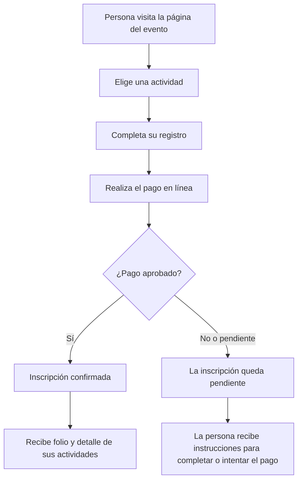
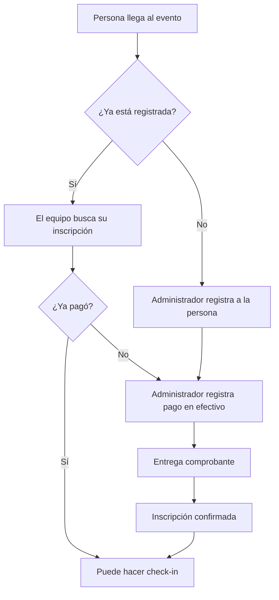
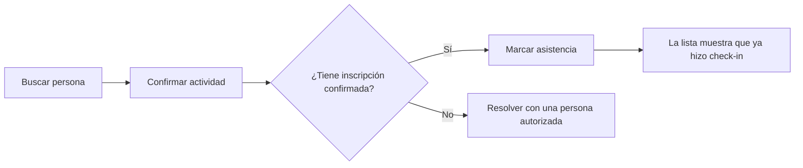
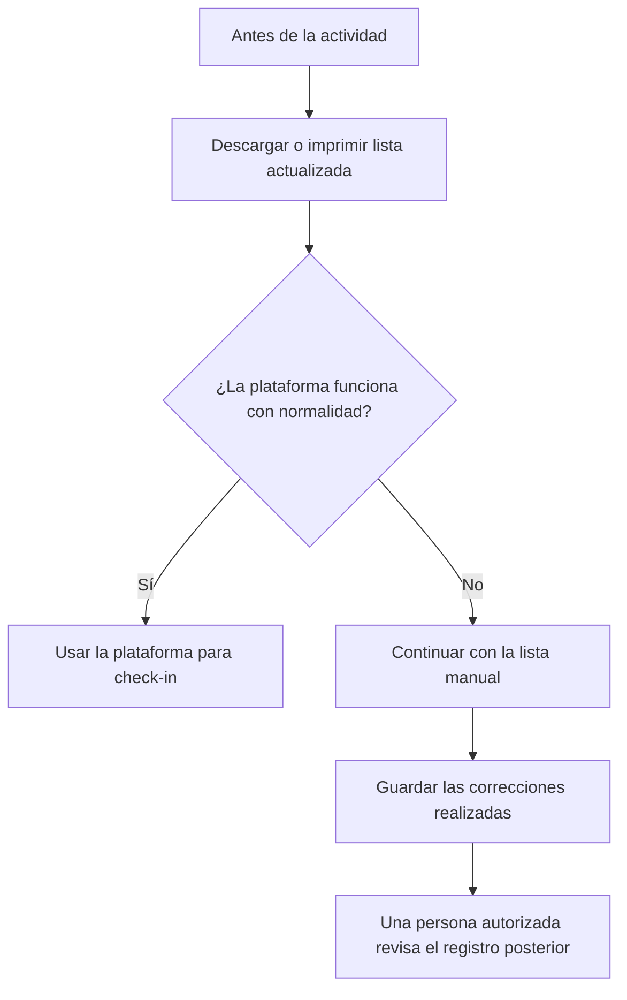

# Propuesta de MVP para noviembre de 2026

> **Estado:** DRAFT — propuesta para validar con el equipo organizador.\
> **Objetivo:** que una persona pueda comprar su acceso, quedar registrada y hacer check-in el día del evento. El equipo organizador podrá registrar pagos en efectivo y consultar listas de asistentes.

## Resumen

La propuesta busca reemplazar una parte del trabajo manual con una experiencia sencilla, similar a comprar y validar una entrada en una plataforma de eventos:

1. Una persona elige una actividad.
2. Completa sus datos y paga en línea.
3. Su inscripción queda confirmada cuando el pago se aprueba.
4. Al llegar, el equipo realiza el check-in.

La plataforma debe ayudar al evento, nunca detenerlo. Antes de cada actividad, el equipo podrá descargar o imprimir listas para continuar manualmente si fuera necesario.

## Experiencia de compra en línea

### 1. Elegir actividad

La página mostrará las actividades disponibles, por ejemplo:

- Competencia de breaking.
- Workshop.
- Entrada general.

Cada actividad podrá mostrar precio, fecha, lugar y disponibilidad.

### 2. Registrarse y pagar

La persona completa un registro sencillo con los datos necesarios para asistir o competir. Después pasa a una pantalla de pago segura.

Cuando el pago está aprobado, recibe:

- Confirmación de su inscripción.
- Un folio para identificarse.
- El detalle de las actividades que compró.

> La plataforma no confirma una inscripción solo porque la persona regresó de la pantalla de pago. La confirma cuando el pago está realmente aprobado.

## Registro y pago en efectivo

Si una persona llega sin haber pagado en línea, una persona autorizada del equipo puede registrarla y marcar el pago en efectivo.

Solo las personas autorizadas del equipo podrán registrar efectivo o corregir un registro. El sistema conservará quién realizó cada operación para que el equipo pueda revisarla después.

## Check-in de competencias y workshops

Al llegar a una actividad, el personal busca a la persona por nombre, correo, nombre artístico o folio.

El equipo podrá ver de inmediato si la persona:

- Está registrada.
- Tiene una inscripción confirmada.
- Ya hizo check-in.
- Tiene acceso a la competencia o workshop correspondiente.

## Panel para el equipo organizador

| Necesidad | Qué podrá hacer el equipo |
| --- | --- |
| Ver inscritos | Consultar las personas registradas por actividad. |
| Buscar personas | Encontrar por nombre, correo, nombre artístico o folio. |
| Registrar efectivo | Agregar una inscripción presencial y marcar su pago. |
| Hacer check-in | Marcar asistencia para una competencia o workshop. |
| Resolver errores | Corregir registros con autorización. |
| Tener respaldo | Descargar o imprimir listas antes del evento. |

## Continuidad durante el evento

Antes de cada actividad, el equipo podrá descargar o imprimir la lista actualizada. Si hay una falla de conexión o una duda importante, el evento continúa con esa lista.

## Incluido en el MVP

- Venta de boletos en línea.
- Registro de asistentes y competidores.
- Confirmación de inscripción después del pago aprobado.
- Registro presencial con pago en efectivo por una persona autorizada.
- Check-in para competencias y workshops.
- Listas descargables o imprimibles para operación manual.

## No incluido por ahora

- Brackets, puntuaciones, jueces o selección de ganadores.
- Reembolsos automáticos.
- Operación sin conexión o sincronización posterior automática.
- Administración de hoteles, viajes, mercancía o patrocinadores.

## Validación necesaria con el equipo organizador

Esta propuesta busca confirmar la experiencia deseada, no pedir al organizador que diseñe tecnología. El equipo organizador solo necesita validar o corregir:

- Las actividades que estarán a la venta.\
  *Ejemplo de respuesta:* “Competencia 1 vs 1, workshop de top rock y entrada general.”
- Los datos necesarios de cada persona.\
  *Ejemplo de respuesta:* “Para asistentes: nombre y correo. Para competidores: también nombre artístico y categoría.”
- Quiénes pueden registrar efectivo y resolver errores.\
  *Ejemplo de respuesta:* “La persona de caja y la coordinación pueden registrar efectivo; solo coordinación puede corregir un error.”
- Cómo quieren realizar el check-in.\
  *Ejemplo de respuesta:* “En la entrada, buscamos por nombre o folio y marcamos la llegada a cada actividad.”
- Las situaciones reales que debemos contemplar el día del evento.\
  *Ejemplo de respuesta:* “Una persona llega tarde, pierde su folio o dice que pagó pero no aparece confirmada.”

## Validaciones a cargo del equipo de producto

Antes de abrir ventas, el equipo de producto debe validar la cuenta de venta, los medios de pago disponibles, el comportamiento de pagos aprobados, pendientes o rechazados, y la experiencia de compradores internacionales que se acuerde soportar. Estas validaciones no son decisiones técnicas que deba tomar el organizador.
