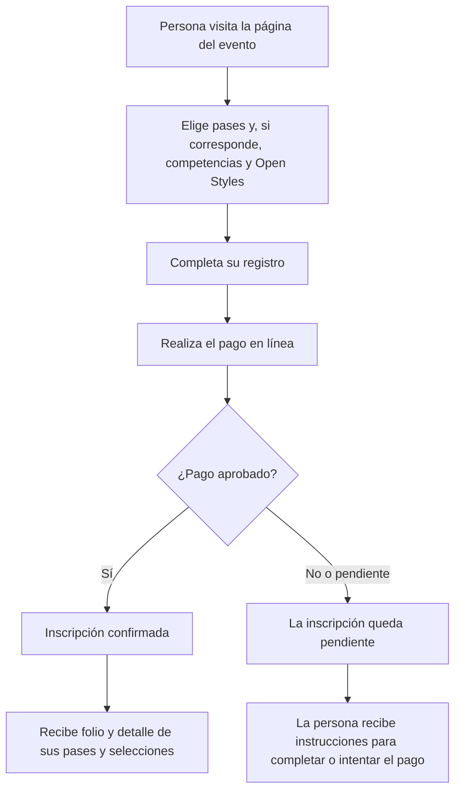
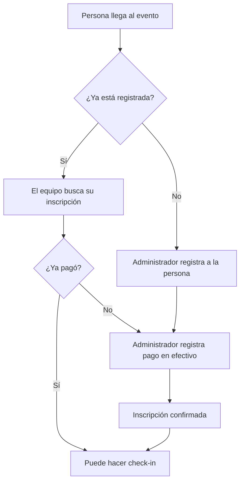
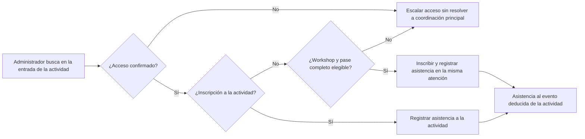
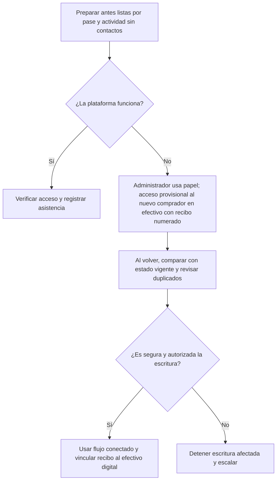

# Propuesta de MVP para noviembre de 2026

> **Estado:** alcance general del MVP aprobado; detalles operativos pendientes de confirmar con el equipo organizador.\
> **Objetivo:** que una persona pueda comprar su pase, quedar registrada y hacer check-in el día del evento. El equipo organizador podrá registrar pagos en efectivo y consultar listas de asistentes.

## Resumen

La propuesta busca reemplazar una parte del trabajo manual con una experiencia sencilla, similar a comprar y validar una entrada en una plataforma de eventos:

1. Una persona elige sus pases; por cada pase completo selecciona sus competencias y puede agregar Open Styles.
2. Completa sus datos y paga en línea.
3. Su inscripción queda confirmada cuando el pago se aprueba.
4. Al llegar, el equipo verifica el acceso y realiza el check-in.

La plataforma debe ayudar al evento, nunca detenerlo. El equipo preparará con anticipación listas por pase y actividad para continuar en papel si fuera necesario.

## Experiencia de compra en línea

### 1. Elegir pases y competencias

La unidad de venta es el pase, no cada actividad:

- Pase completo de **Breaking**, **Popping**, **Locking** o **Dancehall**: **$2000** cada uno. En el MVP, una persona puede comprar varios pases completos y elegir las competencias de cada disciplina adquirida.
- Entrada general: **$1000**; no incluye competencias ni workshops. Cada pase completo ya incluye la entrada general, por lo que no se compran juntos.
- Open Styles: adicional opcional de **$800**, requiere al menos un pase completo; competencia **1vs1**, sin workshops propios.

Competencias a seleccionar con el pase completo:

- **Breaking:** 1v1 Toprock, Footwork, Bboy, Bgirl, Kids, Cypher queen/king y 3v3.
- **Popping:** 1v1, 2v2, 1v1 beginner y Cypher queen/king.
- **Locking:** 1v1 y 3v3.
- **Dancehall:** batallas mixtas.

La persona elige sus competencias de cada disciplina adquirida al comprar sus pases completos; después de la compra, una persona administradora puede cambiar la selección, incluso pasada la fecha límite de selección aún por definir, mediante contacto directo. La participación en competencias y workshops es opcional. Los workshops se anunciarán más adelante y se podrá elegir entre los de todas las disciplinas con pase completo adquirido. En el MVP, el personal podrá inscribir a quien tenga un pase completo elegible al llegar al workshop y registrar su asistencia en la misma interacción de atención. No se gestionan cupos ni requisitos de workshops en el sistema; el personal acomoda el espacio físico en el lugar y registra la asistencia. La persona decide libremente qué actividad priorizar si coinciden workshops o competencias; el equipo intentará evitar cruces entre competencias, pero no puede garantizarlos. La competencia de Open Styles no se cruzará con ninguna competencia de pase completo, aunque puede coincidir parcialmente con workshops. Fechas, horarios, sedes, workshops y fecha límite de selección están pendientes de definir.

### 2. Registrarse y pagar

La persona completa un registro sencillo con los datos necesarios para asistir o competir. El registro mostrará este aviso antes del pago: “Algunas competencias o workshops pueden coincidir en horario. Puedes elegir libremente a cuáles asistir; intentaremos evitar cruces entre competencias, pero no podemos garantizarlos. Open Styles no coincidirá con competencias de pase completo, aunque podría coincidir parcialmente con workshops.” Antes de pagar, la persona debe aceptar el Reglamento oficial, el Aviso de privacidad y la Política de cancelación. Después pasa a una pantalla de pago segura de Mercado Pago. En el MVP solo se aceptan pagos desde México.

Cuando el pago está aprobado, recibe:

- Confirmación de su inscripción.
- Un folio para identificarse.
- El detalle de los pases adquiridos y las competencias seleccionadas (y Open Styles, si corresponde); los workshops se inscriben después.

> La plataforma no confirma una inscripción solo porque la persona regresó de la pantalla de pago. La confirma cuando el pago está realmente aprobado.

## Registro y pago en efectivo

Para el MVP se desea que, si una persona llega sin haber pagado en línea, una persona administradora pueda registrarla desde una opción privada del panel con los mismos datos solicitados en el registro en línea (#58). Una coincidencia de correo o teléfono deberá confirmarse por una persona administradora, sin bloqueo automático. El personal verifica físicamente el importe en efectivo antes de registrarlo. Hoy el registro presencial implementado pide otros campos y bloquea coincidencias de correo o teléfono; hace falta conciliarlo con esta política.

Cada pago en efectivo deberá llevar recibo de papel numerado por duplicado: la copia se entrega a la persona participante y el original queda en poder del equipo. El número de recibo deberá ser obligatorio en el registro digital del efectivo; hoy ese dato es opcional en lo implementado, por lo que requiere ajuste. Solo administradores, nunca jueces, pueden registrar efectivo o corregir un registro. Una corrección de efectivo requiere cotejar el recibo original y registrar el motivo. Si no se dispone del original o hay discrepancias, no se da por resuelta la corrección: los controles y transiciones para esos casos siguen pendientes. La mera existencia de copias no basta. El sistema conservará quién realizó cada operación para que el equipo pueda revisarla después.

## Check-in de competencias y workshops

En la entrada de cada actividad de la sede, una persona administradora busca por nombre, folio o correo y el sistema verifica el derecho de acceso. No habrá una acción visible separada de check-in al evento: la asistencia al evento se deduce del check-in de la actividad. Para un workshop aún no asignado, el MVP debe permitir atender en una sola interacción la inscripción de quien tenga un pase completo elegible y el registro de asistencia. El contrato actual exige un hecho de asistencia al evento antes del de la actividad y una inscripción previa al workshop. El hecho previo del evento puede mantenerse internamente con una sola acción visible para el personal; queda pendiente conciliar el diseño y el contrato, sin dar por implementado ese flujo. El personal acomoda el espacio físico sin cupos ni requisitos gestionados por el sistema. Las llegadas tarde se resuelven físicamente en la sede; si se pierde el folio, se busca por nombre o correo. Pagos faltantes o pendientes y accesos sin resolver se escalan a coordinación principal para la decisión final.

El equipo podrá ver de inmediato si la persona:

- Está registrada.
- Tiene una inscripción confirmada.
- Ya hizo check-in.
- Tiene inscripción a la competencia o workshop correspondiente; la entrada general por sí sola no da acceso a actividades.

Habrá varios administradores capacitados para este evento, distribuidos entre las sedes; aún no se define cuántos habrá en cada una. Los organizadores principales y la persona coordinadora atienden las escalaciones extraordinarias y toman la decisión final de acceso, con el mismo rol de administrador y sin permisos especiales. Sus nombres y turnos están pendientes de definir.

## Panel para el equipo organizador

- **Ver inscritos:** consultar pases y selecciones por actividad.
- **Buscar personas:** encontrar por nombre, correo, nombre artístico o folio.
- **Registrar efectivo:** registrar presencialmente y vincular el número del recibo al pago digital.
- **Hacer check-in:** verificar acceso y registrar asistencia en la entrada de cada actividad.
- **Resolver errores:** administradores realizan correcciones acotadas y auditadas.
- **Tener respaldo:** preparar listas por pase y actividad para continuar en papel.

## Continuidad durante el evento

Con anticipación (incluso el día anterior), cualquier administrador puede preparar desde el navegador o como PDF las listas por pase y actividad: una del evento completo, una de entrada general, las de pase completo separadas por Breaking, Popping, Locking y Dancehall, una de Open Styles y las de workshops u otras actividades cuando correspondan. Incluyen nombre, AKA, pase, actividad, estado de inscripción y asistencia registrada; no incluyen datos de contacto. Son fotografías del momento y pueden quedar desactualizadas. Solo hay impresoras garantizadas en el estudio principal; la disponibilidad en otras sedes está pendiente de confirmar. Si falla la conexión, cualquier administrador puede hacerse cargo del respaldo en papel y anotar incidencias. También puede recibir a una persona nueva que compra en efectivo: entrega el recibo numerado por duplicado, deja un registro temporal en papel y permite acceso provisional. Al restablecerse el servicio, verifica manualmente cada caso contra el estado vigente, comprueba posibles duplicados y vincula el número de recibo al eventual registro digital del efectivo. No hay sincronización automática, reproducción ciega ni confirmación digital durante la interrupción. Si el estado o la autorización son ambiguos, se detiene la escritura afectada y se escala.

## Incluido en el MVP

- Venta en línea de uno o varios pases completos por persona y disciplina, entrada general y adicional Open Styles con al menos un pase completo.
- Registro de asistentes y competidores; selección opcional de competencias de cada disciplina adquirida en la compra y cambio posterior por administrador, incluso después de la fecha límite pendiente de definir mediante contacto directo.
- Inscripción de titulares de pase completo elegibles a workshops, incluso al llegar, y registro de asistencia en la misma atención. El sistema no gestionará cupos ni requisitos de workshops.
- Confirmación de inscripción después del pago aprobado.
- Registro presencial privado por administrador con recibo numerado obligatorio para el efectivo.
- Check-in en la entrada de competencias y workshops, sin check-in visible separado del evento.
- Listas por pase y actividad para imprimir desde el navegador o guardar como PDF, sin datos de contacto, como respaldo en papel.

## No incluido por ahora

- Brackets, puntuaciones, jueces o selección de ganadores.
- Reembolsos o edición de pagos en Mercado Pago.
- Pagos desde fuera de México; los pagos internacionales quedan para después del MVP.
- Transferencias, cambio de entrada general a participante y edición de folio.
- CSV/Excel, escrituras sin conexión, sincronización automática o reproducción ciega de anotaciones en papel.
- Administración de hoteles, viajes, mercancía o patrocinadores.
- Autoservicio de perfil.

## Correcciones acotadas para administradores

Solo administradores autorizados, nunca jueces, pueden corregir con motivo e historial auditado: nombre o AKA después de advertir y confirmar expresamente el impacto en la identidad compartida entre eventos; intercambio de disciplina de igual precio entre Breaking, Popping, Locking y Dancehall; anulación justificada de una inscripción pendiente; y corrección de efectivo con cotejo del recibo original y motivo registrado, sujeta a controles pendientes cuando el original no esté disponible o exista una disputa. No se presupone propagación automática de cambios entre eventos. La mecánica del intercambio de disciplina entre pases completos aún debe definirse para quienes tengan varios. La corrección acotada de efectivo está aprobada en principio, pero las garantías para discrepancias y sus transiciones concretas siguen pendientes; no habilita edición general ni anulación de inscripciones confirmadas. Los casos pagados que requieren reversión se elevan a los organizadores principales o coordinación fuera de las correcciones automatizadas del MVP. No se editan pagos en Mercado Pago ni se hacen reembolsos. Todos los administradores pueden consultar el historial dentro del evento; se desean dos años de historial para análisis del evento solamente, sujetos a viabilidad técnica y revisión legal. La mecánica de retención aún no se define.

## Validación necesaria con el equipo organizador

Esta propuesta busca confirmar la experiencia deseada, no pedir al organizador que diseñe tecnología. El equipo organizador solo necesita validar o corregir:

- Confirmar la agenda y detalles pendientes (fechas, horarios, sedes, workshops y fecha límite de selección), no volver a definir la venta por actividad: los pases y precios indicados arriba ya forman parte del alcance aprobado.\
  _Ejemplo de respuesta:_ “Confirmaremos sede y horario de las batallas de Breaking y anunciaremos los workshops más adelante.”
- Nombres y turnos de los administradores capacitados en cada sede, y disponibilidad de impresoras fuera del estudio principal.
- Controles y transiciones aún pendientes para correcciones de efectivo sin original disponible o disputadas; el cotejo con el recibo original y el motivo ya están decididos. La advertencia visible del impacto en la identidad compartida y su confirmación expresa corresponden a cambios de nombre o AKA.
- Viabilidad técnica y legal, y mecánica de retención, del historial deseado de dos años para análisis del evento.
- Conciliación de implementación para el registro privado sin bloqueo automático de coincidencias y con los datos de #58, y para que el número de recibo deje de ser opcional en el registro digital de efectivo.
- Conciliación de diseño y contrato para deducir la asistencia al evento del check-in de actividad sin una acción visible separada y permitir inscribir al workshop durante la atención; el contrato actual aún requiere un hecho previo del evento (que puede seguir siendo interno) y la inscripción al workshop antes del hecho de actividad.

## Validaciones a cargo del equipo de producto

Antes de abrir ventas, el equipo de producto debe validar la cuenta de venta, los medios de pago disponibles, el comportamiento de pagos aprobados, pendientes o rechazados. En el MVP solo se aceptan pagos desde México; los pagos internacionales quedan para después del MVP. Estas validaciones no son decisiones técnicas que deba tomar el organizador.
